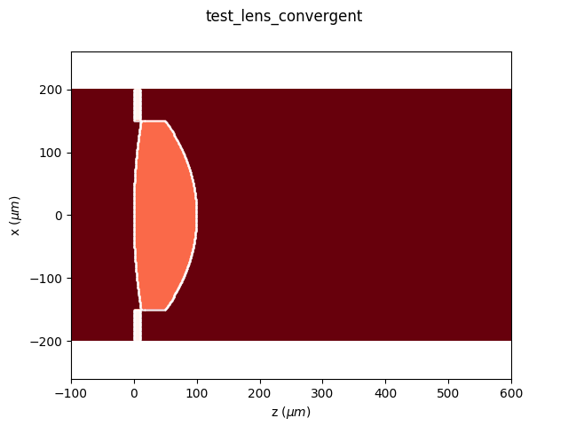
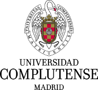

================================================
Python Diffraction-Interference module
================================================

.. image:: https://img.shields.io/pypi/v/diffractio.svg
        :target: https://pypi.org/project/diffractio/

.. image:: https://img.shields.io/travis/optbrea/diffractio.svg
        :target: https://bitbucket.org/optbrea/diffractio/src/master/

.. image:: https://readthedocs.org/projects/diffractio/badge/?version=latest
        :target: https://diffractio.readthedocs.io/en/latest/
        :alt: Documentation Status

* Free software: MIT license

* Documentation: https://diffractio.readthedocs.io/en/latest/

Features
----------------------

Diffractio is a Python library for Diffraction and Interference Optics.

It implements Scalar and paraxial vector Optics. The main algorithms used are:

* Rayleigh Sommerfeld (RS).
* Plane Wave Descomposition (PWD).
* Wave Propagation Method (WPM).
* Beam Propagation Method (BPM).
* Vectorial Rayleigh-Sommerfeld (VRS).

When possible, multiprocessing is implemented for a faster computation.

The scalar propagations techniques are implemented in modules:

* X - fields are defined in the x axis.
* XZ - fields are defined in the xz plane, being z the propagation direction.
* XY - fields are defined in the xy transversal plane.
* XYZ - fields are defined in the xyz volume.

Each technique present three modules:

* sources: Generation of light.
* masks: Masks and Diffractive Optical elements.
* fields:  Propagation techniques, parameters and general functions.

The paraxial vector propagation techniques are implemented in modules:

* vector_paraxial_XY - Ex and Ey electric field components are defined, which allows polarization analysis.

For the vector analysis, we also use the py_pol module: https://pypi.org/project/py-pol/

Sources
========

One main part of this software is the generation of optical fields such as:

* Plane waves.
* Spherical waves.
* Gaussian beams.
* Bessel beams.
* Aberrated beams.

Also, in the XY module the following sources are defined:

* Vortex beams.
* Laguerre beams.
* Hermite-Gauss beams.
* Zernike beams.
* Bessel beams.

.. image:: source.png
   :width: 400

Masks
=============

Another important part of Diffractio is the generation of masks and Diffractive Optical Elements such as:

* Slits, double slits
* Lenses, diffractive lenses, aspherical lenses.
* Gratings, prisms, biprism
* Rough surfaces, dust are defined as plane. However, in the XZ and XYZ frames, volumetric mask are also possible.

.. image:: mask1.png
   :height: 300

Fields
=========

In these module, algorithms for propagation of light are implemented. We have implemented the following algorithms for light propagation:

* **Rayleigh-Sommerfeld (RS)** which allows in a single step to propagate to a near or far observation plane, which allows fast computations. The fields and the masks must be defined in a plane.

* **Fast Fourier Transform (FFT)** which allows, in a single step to determine the field at the far field.

* **Plane Wave Descomposition (PWD)**. It provides the key idea of the wave propagation method because it emphasizes the decomposition of a field E(r) into its plane waves components by the Fourier transformation.

* **Wave Propagation Method (WPM)**. The WPM [Appl. Opt. 32, 4984 (1993) ] was introduced in order to overcome the major limitations of the beam propagation method (BPM). With the WPM, the range of application can be extended from the simulation of waveguides to simulation of other optical elements like lenses, prisms and gratings. In that reference it was demonstrated that the wave propagation scheme provides valid results for propagation angles up to 85° and that it is not limited to small index variations in the axis of propagation

* **Beam propagation method (BPM)** [Appl. Opt. 24, 3390-3998 (1978)] which allows to analyze the propation of light in volumetric elements, such as spheres, cylinders and other complex forms, provided that the spatial variations in the refraction index are small. It allows graded index structures. It presents a complexity of O(n) in the two-dimensional and O(n2) in the three-dimensional case. It is M is computed according to the split-step propagation scheme.

* **Vectorial Rayleigh-Sommerfeld (VRS)**. The VRS mehtod [Laser Phys. Lett. 10(6) 065004 (2013).] allows to propagate (Ex,Ey,Ez) fields offering the advantage of significant reduction in computation, from flat diffractive elements (Thin Element Approximation) with full control of polarization. It addresses simultaneously both longitudinal polarization. This approach offers the advantage of significant reduction in computation.

* **Vector Wave Propagation Method (VWPM)**.  The VWPM metho [J. Opt. Soc. Am. A  27(4), 709-717 (2010)] extends the WPM to three-dimensional vectorial fields (VWPMs) by considering the polarization dependent Fresnel coefficients for transmission in each propagation step. The continuity of the electric field is maintained in all three dimensions by an enhanced propagation vector and the transfer matrix. - in development

The fields, masks and sources can be stored in files.

Also drawings can be easily obtained, for intensity, phase, fields, etc.

In some modules, videos can be generated for a better analysis of optical fields.

.. image:: propagation.png
   :width: 400

Paraxial vector beams
==================================

Here, we implement new classes where the fields E_x and E_y are generated and propagted using Rayleigh-Sommerfeld approach.
Also, simple and complex polarizing masks can be created.

**Ex and Ey fields**

.. image:: vector_gauss_radial_fields.png
   :width: 700

**Polarization: Stokes parameters**

.. image:: vector_gauss_radial_stokes.png
  :width: 700

Other features
=================

* Intensity, MTF and other parameters are obtained from the optical fields.

* Fields can be added and interference is produced. Masks can be multiplied, added and substracted in order to make complex structures

* Resampling fields in order to analyze only areas of interest.

* Save and load data for future analysis.

* Rayleigh-Sommerfeld implementation is performed in multiprocessing for fast computation.

* Polychromatic and extended source problems can also be analyzed using multiprocessing.

Authors
---------------------------

* Luis Miguel Sanchez Brea <optbrea@ucm.es>

    **Universidad Complutense de Madrid**,
    Faculty of Physical Sciences,
    Department of Optics
    Plaza de las ciencias 1,
    ES-28040 Madrid (Spain)

Citing
---------------------------

L.M. Sanchez Brea, "Diffractio, python module for diffraction and interference optics", https://pypi.org/project/diffractio/ (2019)

References
---------------------------

**Propagation algorithms**:

* Shen, F. & Wang, A. Fast-Fourier-transform based numerical integration method for the Rayleigh-Sommerfeld diffraction formula. Appl. Opt. 45, 1102–1110 (2006).
* Fertig, M. & Brenner, K.-H. Vector wave propagation method. J. Opt. Soc. Am. A 27, 709 (2010).
* Fertig, M. & Brenner, K.-H. Vector wave propagation method. PhD thesis (Mannheim, 2010).
* Ye, H. et al. Creation of a longitudinally polarized subwavelength hotspot with an ultra-thin planar lens: Vectorial Rayleigh-Sommerfeld method. Laser Phys. Lett. 10, (2013).
* Schmidt, S. et al. Wave-optical modeling beyond the thin-element-approximation. Opt. Express 24, 30188 (2016).
* Schmidt, S., Thiele, S., Herkommer, A., Tünnermann, A. & Gross, H. Rotationally symmetric formulation of the wave propagation method-application to the straylight analysis of diffractive lenses. Opt. Lett. 42, 1612 (2017).

**Other references**

* J.W. Goodman, Introduction to Fourier optics. McGraw-Hill, 1996.
* B.E. Saleh y M. C. Teich, Fundamentals of photonics. John Wiley & Sons, 2019.
* Z.Qiwen, Vectorial optical fields: Fundamentals and applications. World scientific, 2013.
* J.A. Ogilvy, Theory of Wave Scattering from Random Rough Surfaces.Adam Hilger, 1991.
* "Numerical Methods in Photonics Lecture Notes".  http://ecee.colorado.edu/~mcleod/teaching/nmip/lecturenotes.html.
* Beam width: https://en.wikipedia.org/wiki/Beam_diameter

Credits
---------------------------

This package was created with Cookiecutter_ and the `audreyr/cookiecutter-pypackage`_ project template.

.. _Cookiecutter: https://github.com/audreyr/cookiecutter
.. _`audreyr/cookiecutter-pypackage`: https://github.com/audreyr/cookiecutter-pypackage
