=====
Usage
=====

To use Python diffraction and interference in a project:

.. code-block:: python

    import diffractio

X fields
=================

.. code-block:: python

  from diffractio import um, nm, mm, np
  from diffractio.scalar_fields_X import Scalar_field_X
  from diffractio.scalar_sources_X import Scalar_source_X
  from diffractio.scalar_masks_X import Scalar_mask_X

  x = np.linspace(-500 * um, 500 * um, 4096)
  wavelength = .6328 * um

  u0 = Scalar_source_X(x, wavelength)
  u0.gauss_beam(x0=0, w0=300*um, z0=0)
  u0.draw(filename='usage1.png')

  t0=Scalar_mask_X(x, wavelength)
  t0.slit(x0=0, size=250*um)
  t0.draw(filename='usage2.png')

  u1=t0*u0
  u2 = u1.RS(z=5 * mm, new_field=True)
  u2.draw(filename='usage3.png')

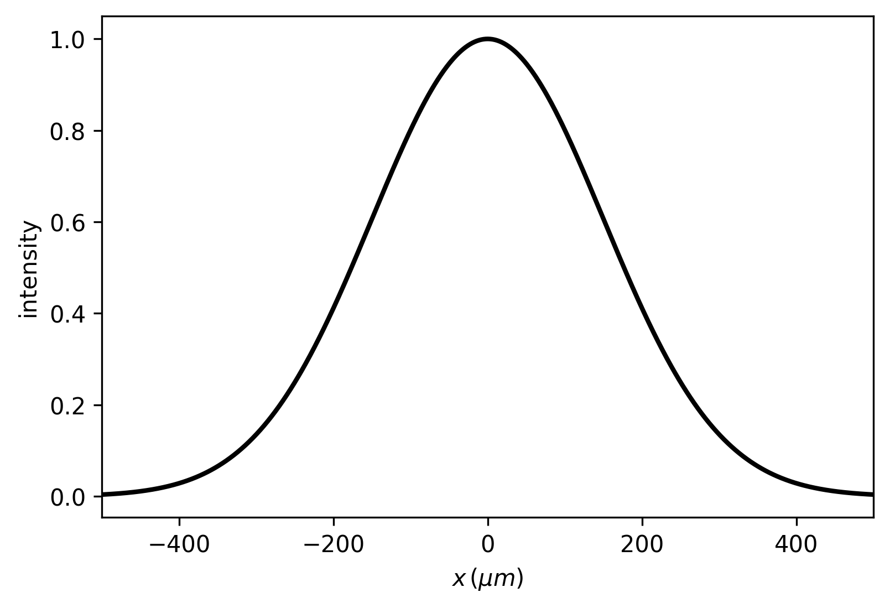
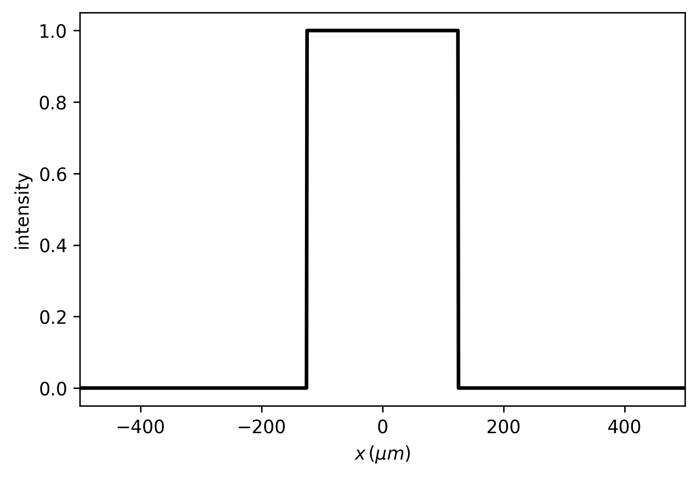

XZ fields
=================

.. code-block:: python

  from diffractio import um, nm, mm, np,degrees
  from diffractio.scalar_sources_X import Scalar_source_X
  from diffractio.scalar_fields_XZ import Scalar_field_XZ
  from diffractio.scalar_masks_XZ import Scalar_mask_XZ

  x0 = np.linspace(-100 * um, 100 * um, 512)
  z0 = np.linspace(0 * um, 300 * um, 512)
  wavelength = 5 * um
  u0 = Scalar_source_X(x=x0, wavelength=wavelength)
  u0.gauss_beam(A=1, x0=0 * um, z0=0 * um, w0=75 * um, theta=0 * degrees)
  u0.draw(kind='field', filename='usage4.png')

  u1 = Scalar_mask_XZ(x=x0, z=z0, wavelength=wavelength)
  u1.incident_field(u0)
  u1.rectangle(r0=(0 * um, 100 * um),
    size=(100 * um, 100 * um),
    angle=45 * degrees,
    refraction_index=2)

  u1.draw_refraction_index(filename='usage5.png', scale='scaled')
  u1.WPM(verbose=False)
  u1.draw(logarithm=True, normalize='maximum', draw_borders=True, filename='usage6.png', scale='scaled');

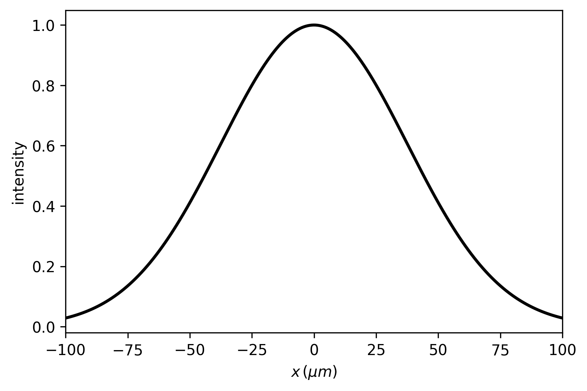
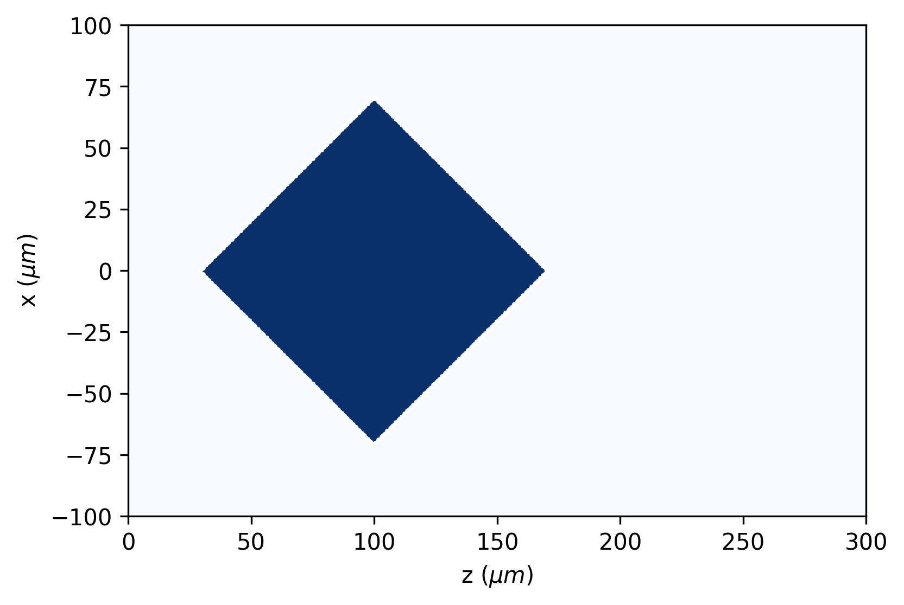
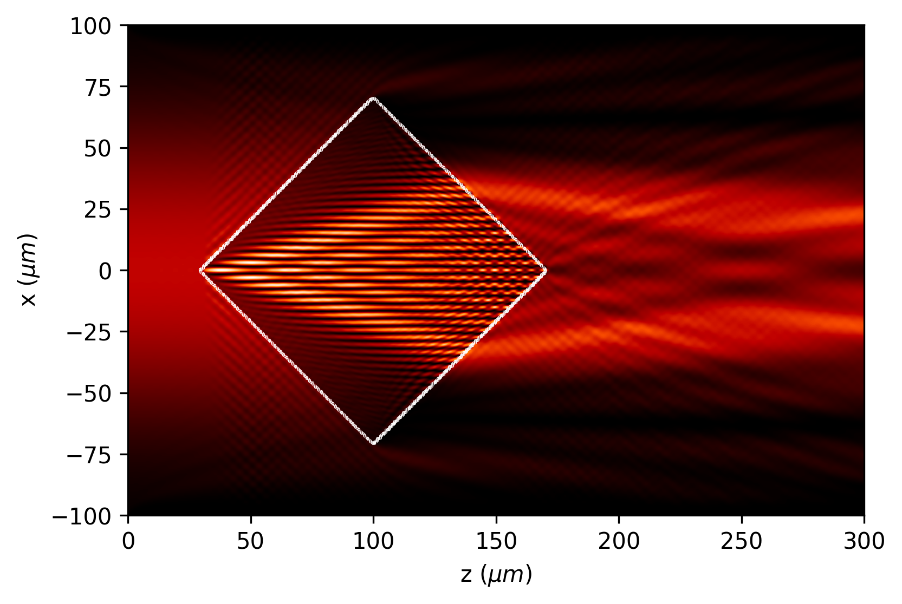

XY fields
=================

.. code-block:: python

  from diffractio import um, nm, mm, np, degrees
  from diffractio.scalar_sources_XY import Scalar_source_XY
  from diffractio.scalar_fields_XY import Scalar_field_XY
  from diffractio.scalar_masks_XY import Scalar_mask_XY

  length = 1000*um
  x0 = np.linspace(-length/2, length/2, 512)
  y0 = np.linspace(-length/2, length/2, 512)
  wavelength = 0.6238 * um

  focus=10*mm

  u0 = Scalar_source_XY(x=x0, y=y0, wavelength=wavelength)

  u0.zernike_beam(A=1, r0=(0, 0), radius=length / 2, n=[ 0,4,], m=[0,3,], c_nm=[ 1,0.25,])
  u0.draw(kind='phase', filename='usage7.png')

  t0 = Scalar_mask_XY(x=x0, y=y0, wavelength=wavelength)
  t0.fresnel_lens(
    r0=(0 * um, 0 * um),
    radius=(500 * um, 500 * um),
    focal=(focus,focus),
    angle=0 * degrees,
    kind='amplitude',
    phase=np.pi)
  t0.draw(filename='usage8.png')

  u1 = u0 * t0
  u2 = u1.RS(z=focus, new_field=True)
  u2.cut_resample(
    x_limits=(-100 * um, 100 * um),
    y_limits=(-100 * um, 100 * um),
    num_points=[1024, 1024],
    new_field=False)
  u2.draw(kind='intensity', logarithm=True, filename='usage9.png')

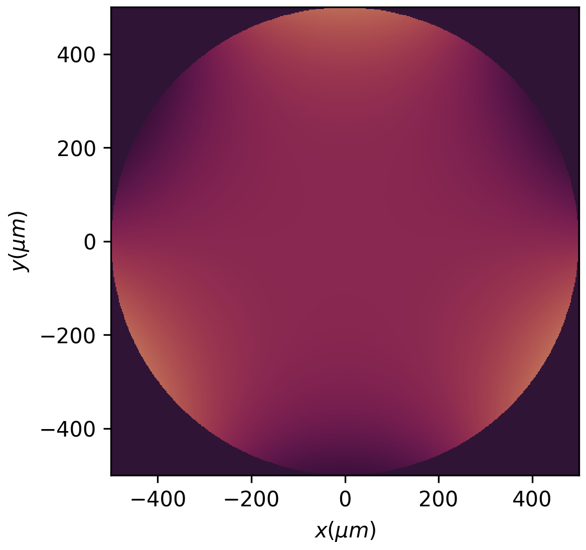
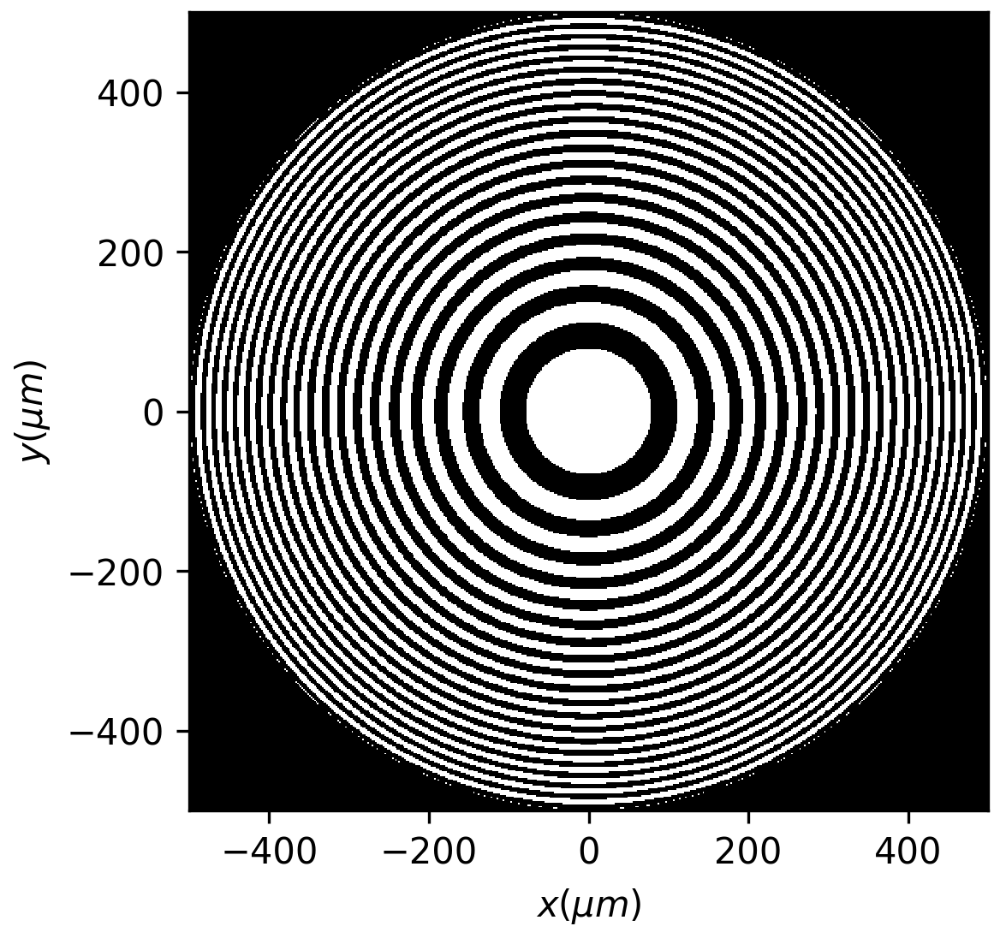
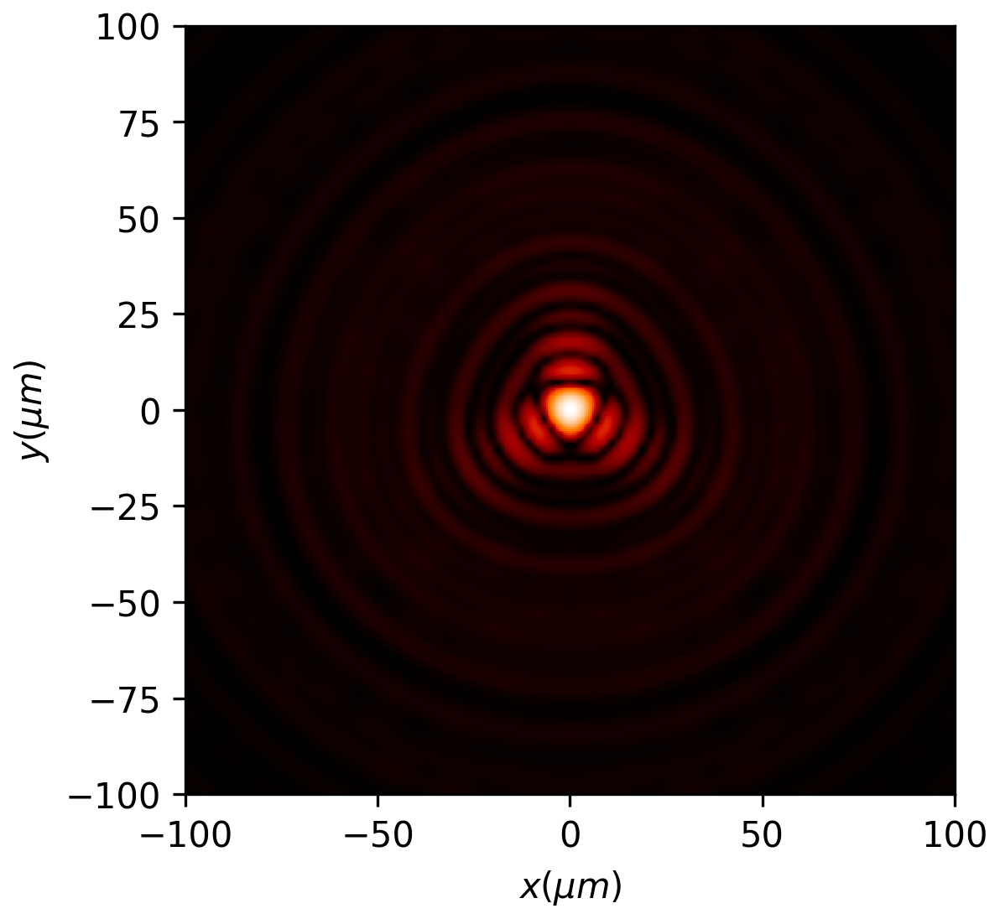

XYZ fields
=================

.. code-block:: python

  from diffractio import degrees, eps, mm, no_date, np, um
  from diffractio.scalar_fields_XYZ import Scalar_field_XYZ
  from diffractio.scalar_masks_XY import Scalar_mask_XY
  from diffractio.scalar_masks_XYZ import Scalar_mask_XYZ
  from diffractio.scalar_sources_XY import Scalar_source_XY

  x0 = np.linspace(-25 * um, 25 * um, 128)
  y0 = np.linspace(-25 * um, 25 * um, 128)
  z0 = np.linspace(100 * um, 500 * um, 256)
  wavelength = .6328 * um

  t1 = Scalar_mask_XY(x=x0, y=y0, wavelength=wavelength)
  t1.circle(
      r0=(0 * um, 0 * um), radius=(10 * um, 10 * um), angle=0 * degrees)
  t1.draw(filename='usage10.png')

  uxyz = Scalar_mask_XYZ(x=x0, y=y0, z=z0, wavelength=wavelength)
  uxyz.incident_field(u0=t1)

  uxyz.RS(verbose=True, num_processors=4)

  uxyz.draw_XYZ(y0=0 * mm, logarithm=True, normalize='maximum',filename='xyz_RS.png')

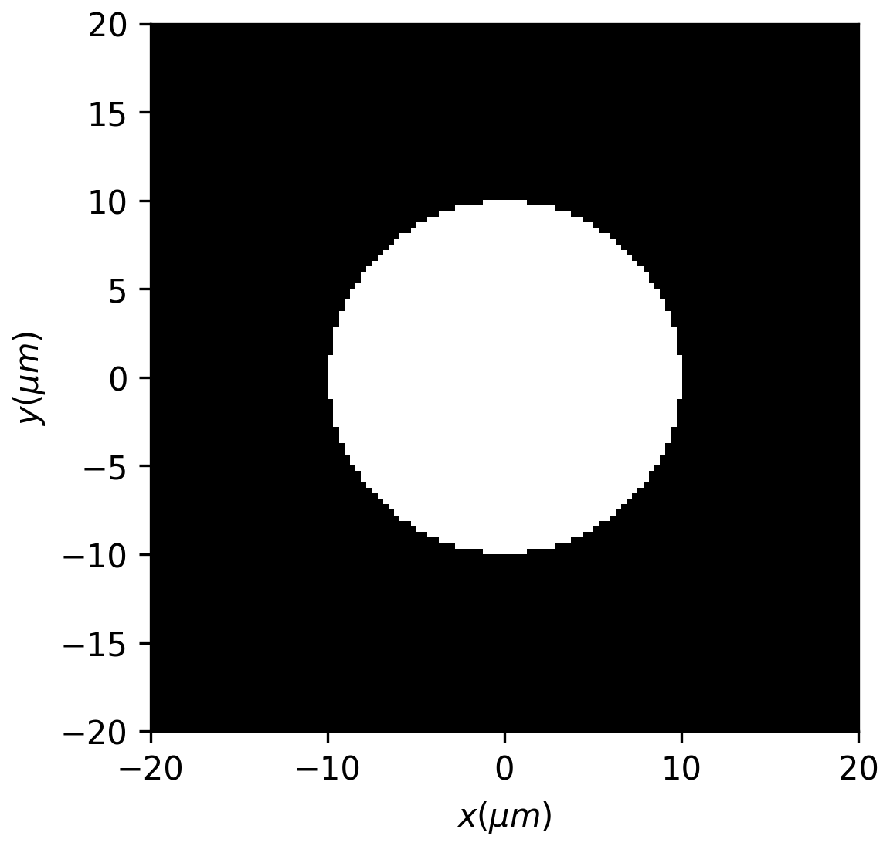

.. figure:: xyz_RS.png
  :width: 600

XY Vector fields
==================================

.. code-block:: python

  from diffractio import np, sp, plt
from diffractio import nm, um, mm, degrees

  from diffractio.scalar_sources_XY import Scalar_source_XY
  from diffractio.scalar_masks_XY import Scalar_mask_XY
  from diffractio.scalar_fields_XY import Scalar_field_XY

  from diffractio.vector_sources_XY import Vector_source_XY
  from diffractio.vector_masks_XY import Vector_mask_XY
  from diffractio.vector_fields_XY import Vector_field_XY

  x0 = np.linspace(-125 * um, 125 * um, 256)
  y0 = np.linspace(-125 * um, 125 * um, 256)

  wavelength = 0.6328 * um

  u0 = Scalar_source_XY(x0, y0, wavelength)
  u0.gauss_beam(
    r0=(0, 0),
    w0=(100 * um, 100 * um),
    z0=0 * um,
    A=1,
    theta=0. * degrees,
    phi=0 * degrees)

  EM0 = Vector_source_XY(x0, y0, wavelength)
  EM0.azimuthal_wave(u=u0, r0=(0, 0), radius=(200, 200))
  EM0.draw(kind='ellipses')
  plt.title('Before mask')
  plt.savefig('usage12.png')

  t0 = Scalar_mask_XY(x0, y0, wavelength)
  t0.two_levels(level1=0, level2=1, x_edge=0, angle=0)

  M0 = Vector_mask_XY(x=x0, y=y0, wavelength=wavelength)

  state_0 = np.array([[1, 0],[0, 0]])
  state_1 = np.array([[0, 0],[0, 1]])

  M0.complementary_masks(t0, state_0, state_1)

  EM1 = EM0 * M0
  EM1.draw(kind='ellipses')
  plt.title('After mask')
  plt.savefig('usage13.png')

  EM2 = EM1.RS(z=10 * mm)

  EM2.draw(kind='ellipses')
  plt.title('After propagation')
  plt.savefig('usage14.png')

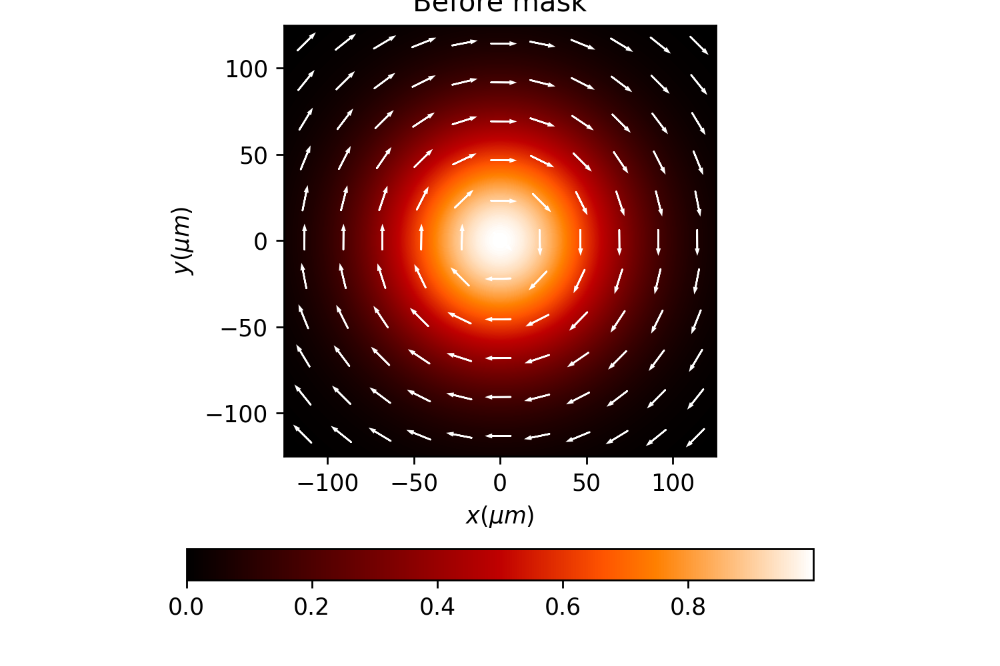
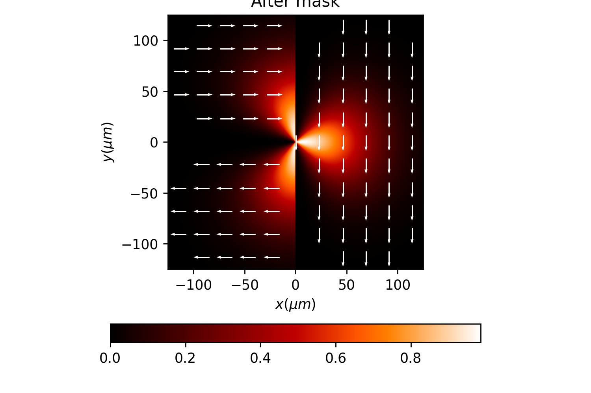
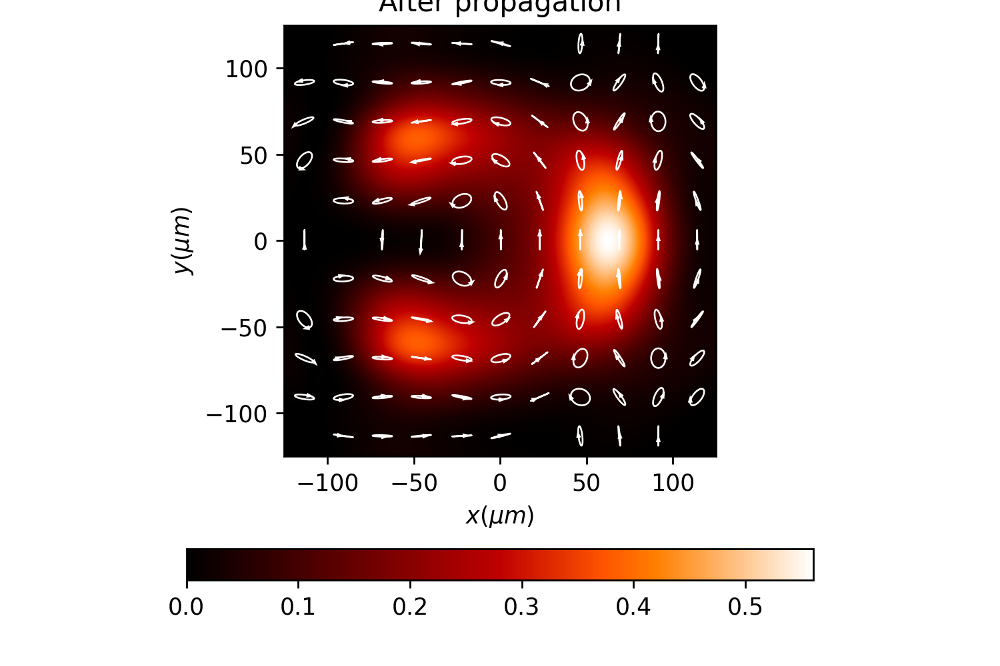
