=====
Usage
=====

To use Python diffraction and interference in a project:

.. code-block:: python

    import diffractio

Examples of use
---------------------------

X fields
=================

.. code-block:: python

  from diffractio import um, nm, mm, np
  from diffractio.scalar_fields_X import Scalar_field_X
  from diffractio.scalar_sources_X import Scalar_source_X
  from diffractio.scalar_masks_X import Scalar_mask_X

  x = np.linspace(-500 * um, 500 * um, 4096)
  wavelength = .6328 * um

  u0 = Scalar_source_X(x, wavelength)
  u0.gauss_beam(x0=0, w0=300*um, z0=0)
  u0.draw(filename='x_source.png')

  t0=Scalar_mask_X(x, wavelength)
  t0.slit(x0=0, size=250*um)
  t0.draw(filename='x_mask.png')

  u1=t0*u0

  u2 = u1.RS(z=5 * mm, new_field=True)
  u2.draw(filename='x_RS.png')

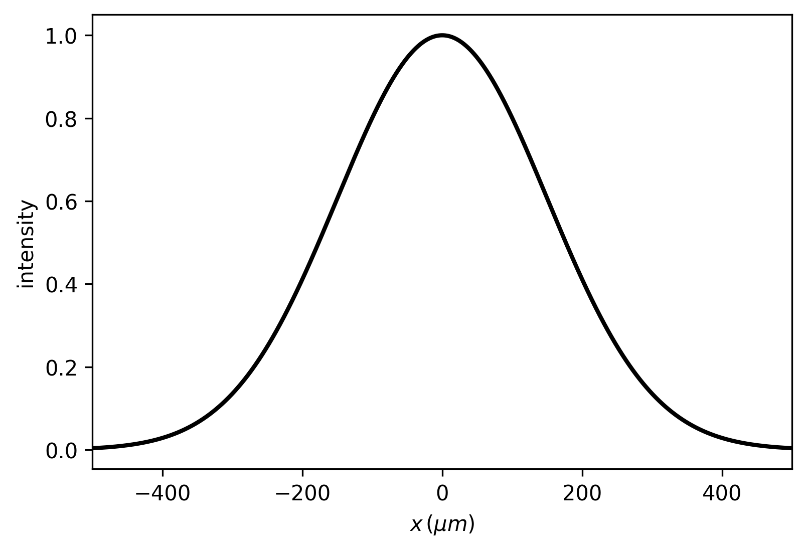
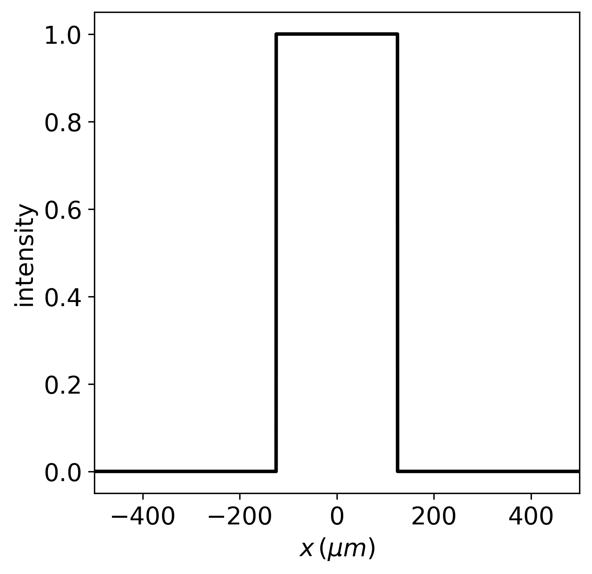
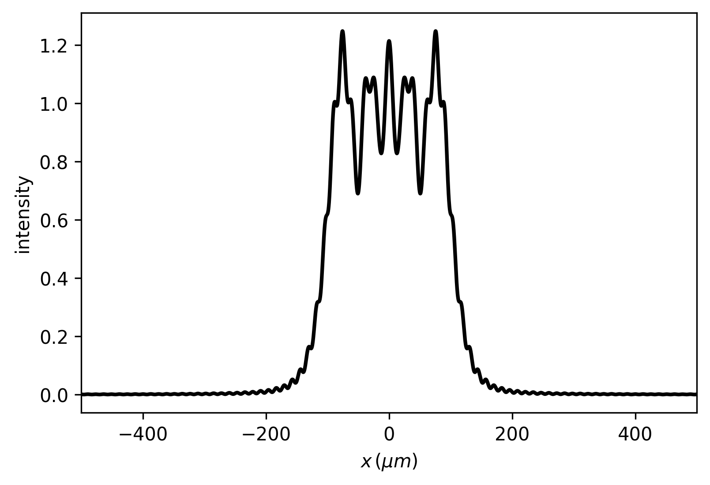

XZ fields
=================

.. code-block:: python

  from diffractio import um, nm, mm, np,degrees
  from diffractio.scalar_sources_X import Scalar_source_X
  from diffractio.scalar_fields_XZ import Scalar_field_XZ
  from diffractio.scalar_masks_XZ import Scalar_mask_XZ

  x0 = np.linspace(-100 * um, 100 * um, 512)
  z0 = np.linspace(0 * um, 200 * um, 512)
  wavelength = 5 * um

  u0 = Scalar_source_X(x=x0, wavelength=wavelength)
  u0.gauss_beam(
      A=1, x0=0 * um, z0=0 * um, w0=75 * um, theta=-5 * degrees)
  u0.draw(kind='field', filename='xz_source.png')

  u1 = Scalar_mask_XZ(x=x0, z=z0, wavelength=wavelength)
  u1.incident_field(u0)
  u1.rectangle(
      r0=(0 * um, 100 * um),
      size=(150 * um, 50 * um),
      angle=45 * degrees,
      refraction_index=1.8)
  u1.draw_refraction_index(filename='xz_mask.png')

  u1.BPM(verbose=False)
  u1.draw(logarithm=True, normalize='maximum', draw_borders=True, filename='xz_BPM.png')

.. figure:: xz_source.png
  :width: 600
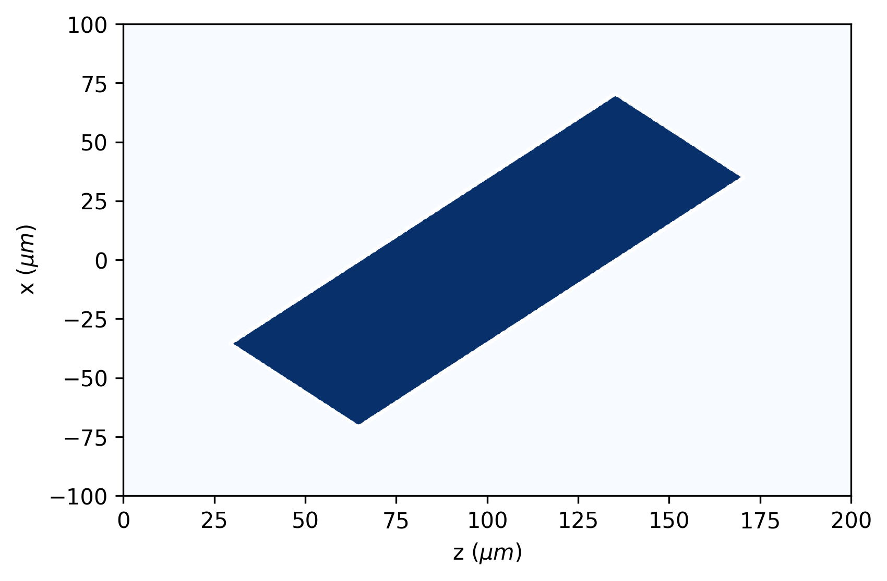
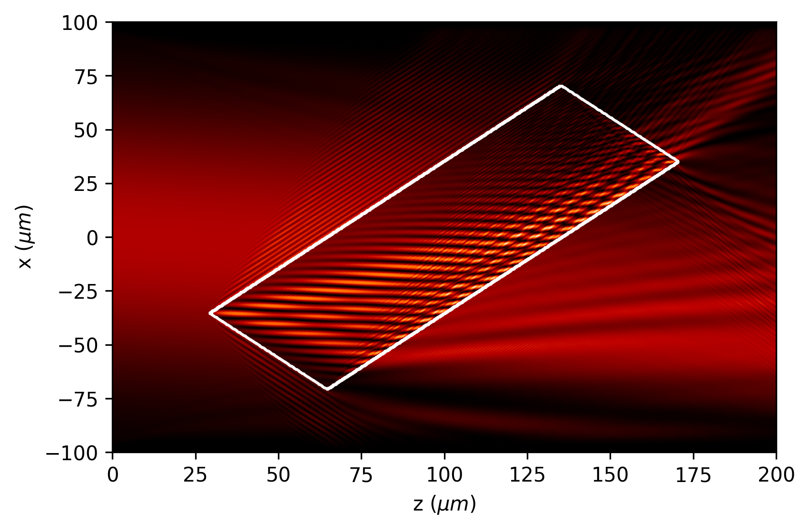

XY fields
=================

.. code-block:: python

  from diffractio import um, nm, mm, np, degrees
  from diffractio.scalar_sources_XY import Scalar_source_XY
  from diffractio.scalar_fields_XY import Scalar_field_XY
  from diffractio.scalar_masks_XY import Scalar_mask_XY

  length = 1 * mm
  num_data = 1024
  x0 = np.linspace(-length / 2, length / 2, num_data)
  y0 = np.linspace(-length / 2, length / 2, num_data)
  wavelength = 0.6238 * um

  u0 = Scalar_source_XY(x=x0, y=y0, wavelength=wavelength)
  u0.zernike_beam(A=1, r0=(0, 0), radius=length / 2, n=[4,], m=[3,], c_nm=[1,], mask=True)
  u0.draw(kind='phase', filename='xy_source.png')

  t0 = Scalar_mask_XY(x=x0, y=y0, wavelength=wavelength)
  t0.fresnel_lens(
      r0=(0 * um, 0 * um),
      radius=(500 * um, 500 * um),
      focal=(10 * mm, 10 * mm),
      angle=0 * degrees,
      mask=True,
      kind='amplitude',
      phase=np.pi)
  t0.draw(filename='xy_mask.png')

  u1 = u0 * t0

  u2 = u1.RS(z=9 * mm, new_field=True)

  u2.cut_resample(
      x_limits=(-100 * um, 100 * um),
      y_limits=(-100 * um, 100 * um),
      num_points=[1024, 1024],
      new_field=False,
      interp_kind=(3, 1))
  u2.draw(kind='intensity', logarithm=True, filename='xy_RS.png')

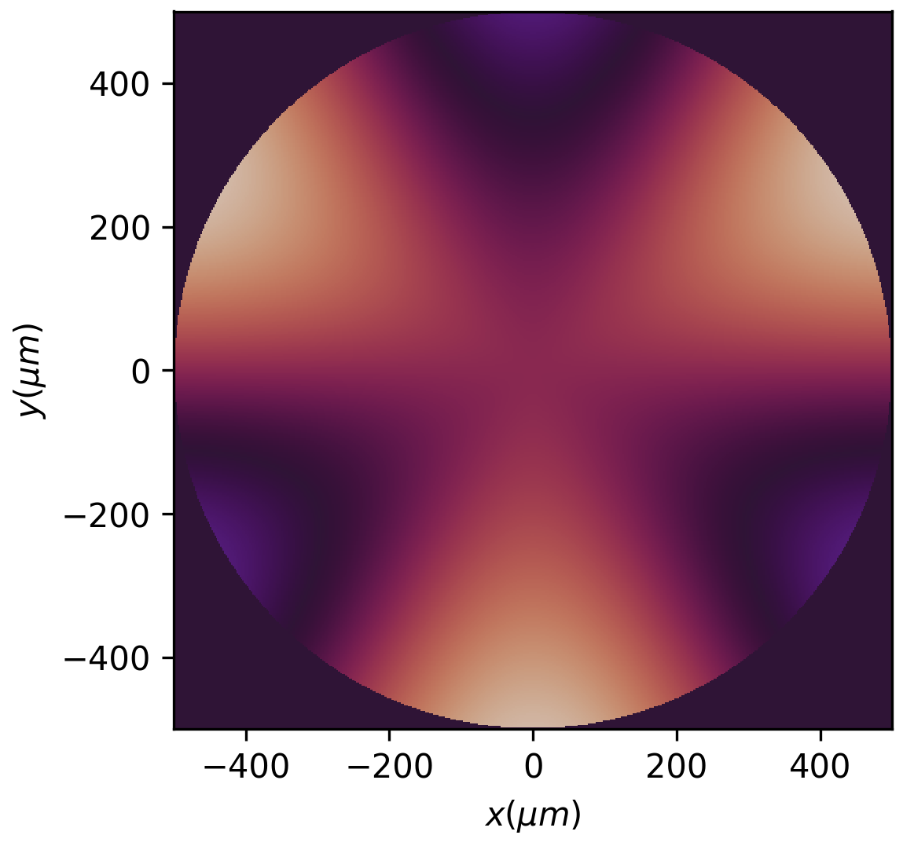
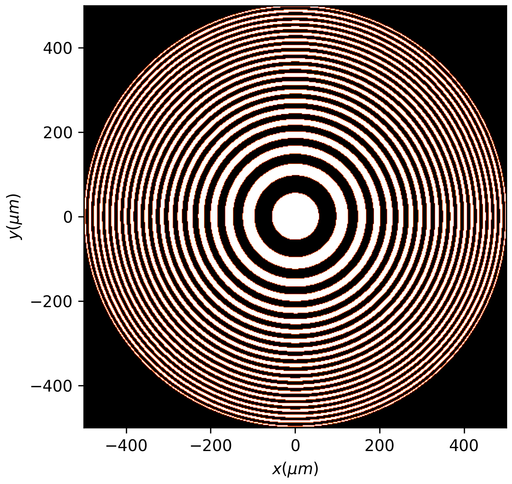
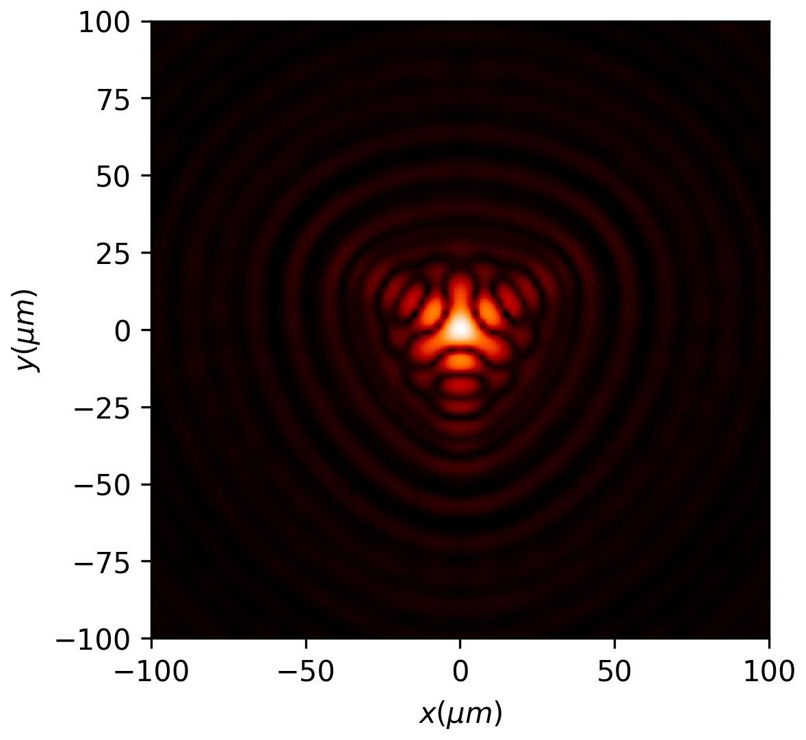

XYZ fields
=================

.. code-block:: python

  from diffractio import degrees, eps, mm, no_date, np, um
  from diffractio.scalar_fields_XYZ import Scalar_field_XYZ
  from diffractio.scalar_masks_XY import Scalar_mask_XY
  from diffractio.scalar_masks_XYZ import Scalar_mask_XYZ
  from diffractio.scalar_sources_XY import Scalar_source_XY

  x0 = np.linspace(-25 * um, 25 * um, 128)
  y0 = np.linspace(-25 * um, 25 * um, 128)
  z0 = np.linspace(100 * um, 500 * um, 256)
  wavelength = .6328 * um

  t1 = Scalar_mask_XY(x=x0, y=y0, wavelength=wavelength)
  t1.circle(
      r0=(0 * um, 0 * um), radius=(10 * um, 10 * um), angle=0 * degrees)
  t1.draw(filename='xyz_mask.png')

  uxyz = Scalar_mask_XYZ(x=x0, y=y0, z=z0, wavelength=wavelength)
  uxyz.incident_field(u0=t1)

  uxyz.RS(verbose=True, num_processors=4)

  uxyz.draw_XYZ(y0=0 * mm, logarithm=True, normalize='maximum',filename='xyz_cut.png')

.. figure:: xyz_mask.png
  :width: 600
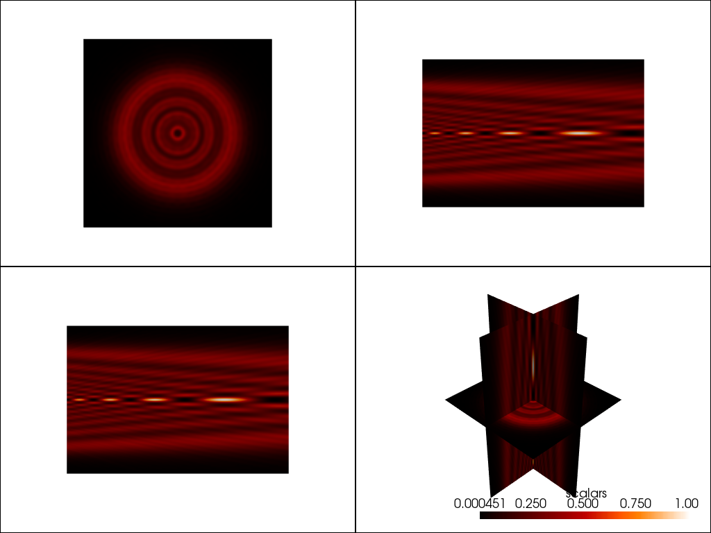
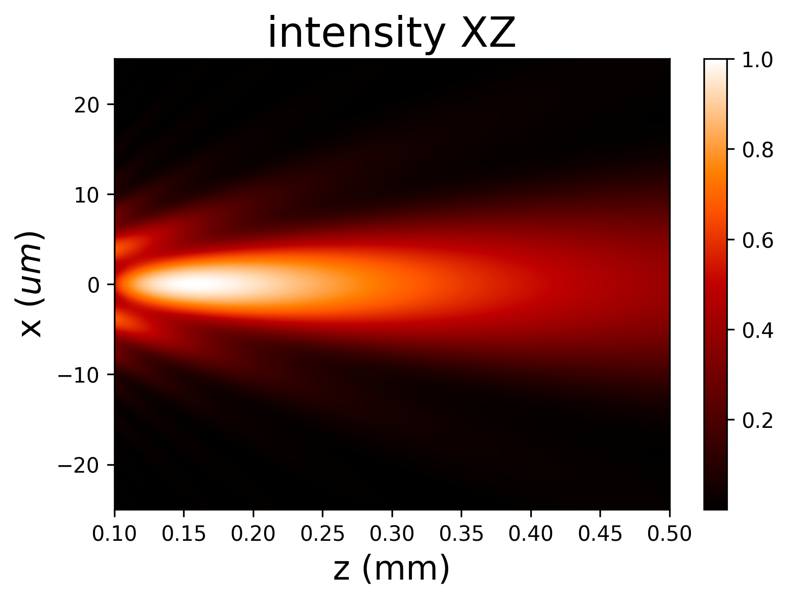

XY Vector paraxial fields
==================================

.. code-block:: python

  from diffractio import degrees, mm, nm, np, plt, sp, um

  from diffractio.scalar_sources_XY import Scalar_source_XY
  from diffractio.scalar_masks_XY import Scalar_mask_XY
  from diffractio.scalar_fields_XY import Scalar_field_XY

  from diffractio.vector_paraxial_sources_XY import Vector_paraxial_source_XY
  from diffractio.vector_paraxial_masks_XY import Vector_paraxial_mask_XY
  from diffractio.vector_paraxial_fields_XY import Vector_paraxial_field_XY

  x0 = np.linspace(-125 * um, 125 * um, 512)
  y0 = np.linspace(-125 * um, 125 * um, 512)

  wavelength = 0.6328 * um

  u0 = Scalar_source_XY(x0, y0, wavelength)
  u0.gauss_beam(
      r0=(0, 0),
      w0=(100 * um, 100 * um),
      z0=0 * um,
      A=1,
      theta=0. * degrees,
      phi=0 * degrees)

  EM0 = Vector_paraxial_source_XY(x0, y0, wavelength)
  EM0.radial_wave(u=u0, r0=(0, 0), radius=(200, 200))

  t0 = Scalar_mask_XY(x0, y0, wavelength)
  t0.two_levels(level1=0, level2=1, xcorte=0, angle=0)

  M0 = Vector_paraxial_mask_XY(x=x0, y=y0, wavelength=wavelength)
  M0.complementary_masks(t0, v1=(1, 1j), v2=(1, -1j))

  EM1 = EM0 * M0

  EM2 = EM1.RS(z=10 * mm)

  EM2.draw(kind='ellipses', filename='vector_ellipses.png')

  EM2.draw(kind='stokes', filename='vector_stokes.png');

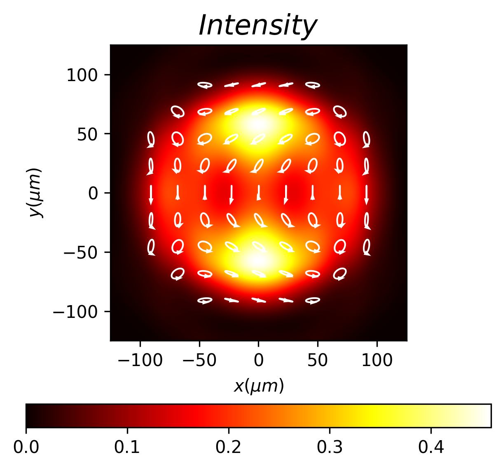
.. figure:: vector_stokes.png
    :width: 600
